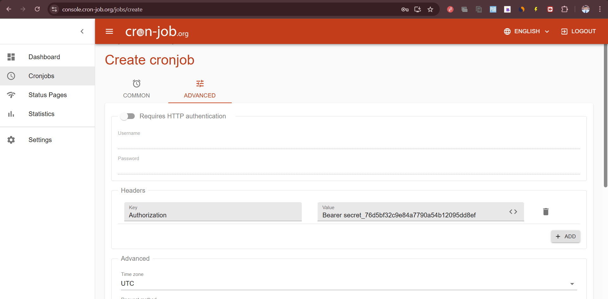

# Setting Up External Cron Jobs for SecretChit

Since Vercel's Hobby plan doesn't include built-in cron jobs, we can use an external service like [Cron-Job.org](https://console.cron-job.org) to trigger our cleanup endpoint regularly.

## Setup Instructions for cron-job.org

### 1. Create an Account on cron-job.org

1. Go to [https://console.cron-job.org](https://console.cron-job.org)
2. Sign up for a free account if you don't have one already

### 2. Create a New Cron Job

1. After logging in, click on "Create cronjob" button
2. Fill in the following details:

#### Common Settings
- **Title**: SecretChit Cleanup
- **URL**: `https://secret-chit-r55.vercel.app/api/cron/cleanup`
- **Schedule**: Every hour (Use the schedule editor to set this up)
- **Timezone**: Select your preferred timezone

#### HTTP Request Settings
- **Request Method**: POST (or GET, both are supported)
- **Authentication**: Add HTTP Header in the Advanced tab
  - **Header Name**: Authorization  
  - **Header Value**: Bearer secret_76d5bf32c9e84a7790a54b12095dd8ef
  
  

- **User Agent**: cron-job.org

#### Notification Settings
- Enable notifications for failed jobs (optional, but recommended)

3. Click "Create" to activate the cron job

### 3. Test the Cron Job

1. In the cron-job.org dashboard, find your newly created job
2. Click "Execute now" to run it immediately
3. Check the execution details to verify it runs successfully
   - You should see HTTP status code 200 with a JSON response showing the number of deleted secrets

## Monitoring and Maintenance

- Check the job history periodically to ensure it's running successfully
- If you update the CRON_SECRET in your environment variables, remember to update it in the cron job settings as well

## Troubleshooting

### Common Issues:

#### 401 Unauthorized Error
- Check that the Authorization header is correctly formatted as `Bearer secret_76d5bf32c9e84a7790a54b12095dd8ef`
- Verify that the CRON_SECRET environment variable in Vercel matches the token in your Authorization header
- Test the endpoint manually using a tool like ReqBin or Postman with proper headers:

#### 500 Server Error
- Check your Vercel deployment logs for details
- Ensure your database connection is working properly

#### Job Not Running
- Verify the cron job is enabled in cron-job.org
- Check the execution history for any error details