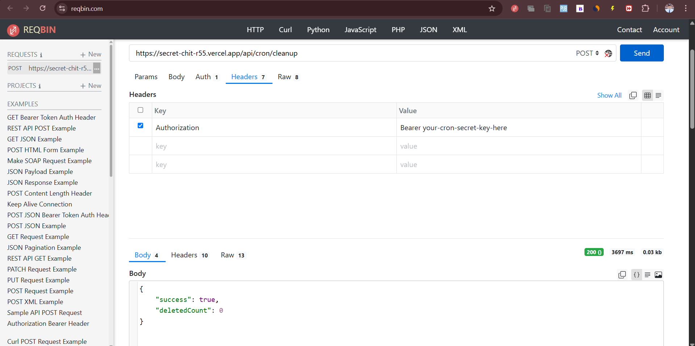

# SecretChit - Secure Secret Sharing Web Application

SecretChit is a full-stack web application that allows users to securely share sensitive information via self-destructing, encrypted messages. Built with TypeScript, Next.js, Prisma, tRPC, and Material UI, it provides a secure and seamless way to share sensitive information like passwords, credentials, and private notes.

🔗 **Live Demo**: [https://secret-chit-r55.vercel.app/](https://secret-chit-r55.vercel.app/)

Try the demo to:
- Create a one-time secret that self-destructs after viewing
- Set expiration times for your sensitive information
- Add password protection for extra security
- View your created secrets in the dashboard (requires login)

## Screenshots

### Home Page - Create a Secret


### User Dashboard - Manage Your Secrets


### View Secret Page


*Note: The screenshots show the application's main features: creating a secret with security options, managing secrets in the user dashboard, and viewing a retrieved secret.*

## Features

- **End-to-End Encryption**: All secrets are encrypted before being stored in the database
- **One-Time Access**: Secrets can be configured to self-destruct after being viewed once
- **Auto-Expiration**: Set an expiration time for secrets (1 hour to 30 days)
- **Password Protection**: Add an optional password for an additional layer of security
- **User Authentication**: Create an account to keep track of your secrets
- **User Dashboard**: Authenticated users can view, manage, and search their secrets
- **Fully Responsive**: Works seamlessly on desktop, tablet, and mobile devices
- **Dark Mode**: Modern dark theme UI using Material UI
- **Automatic Cleanup**: Cron job automatically removes expired secrets from the database

## Technology Stack

- **Frontend**:
  - [Next.js 15](https://nextjs.org/) with App Router architecture
  - [TypeScript](https://www.typescriptlang.org/) for type safety
  - [Material UI 7](https://mui.com/) for component library and theming
  - [React Query](https://tanstack.com/query) for data fetching and state management
  
- **Backend**:
  - [tRPC 11](https://trpc.io/) for type-safe API endpoints
  - [Prisma 6](https://www.prisma.io/) as the ORM for database operations
  - [NextAuth.js 4](https://next-auth.js.org/) for authentication
  - [PostgreSQL](https://www.postgresql.org/) for database
  
- **Security**:
  - [crypto-js](https://github.com/brix/crypto-js) for encryption
  - [bcrypt](https://github.com/kelektiv/node.bcrypt.js) for password hashing
  - [uuid](https://github.com/uuidjs/uuid) for secure ID generation
  - Rate limiting, CSRF protection
  - JWT for token-based authentication

- **DevOps**:
  - [Vercel](https://vercel.com/) for hosting and deployment
  - [cron-job.org] for cron job setup

## Architecture

SecretChit follows a modern full-stack architecture with clear separation of concerns:

### Project Structure

```
/src
  /app                   # Next.js App Router
    /api                 # API routes
      /auth              # NextAuth routes
      /trpc              # tRPC API
      /cron              # Cron job endpoints
    /s/[id]              # Secret viewer page
    /dashboard           # User dashboard
    /auth                # Auth pages
  /components            # React components
  /server
    /auth                # Auth configuration
    /db                  # Database client
    /trpc                # tRPC routers
      /routers           # API endpoints
    /jobs                # Cron jobs
    /utils               # Server utilities
  /utils                 # Shared utilities
/prisma                  # Prisma schema & migrations
/public                  # Static assets
```

### Data Flow

```
┌─────────────────────┐     ┌──────────────────┐     ┌────────────────┐
│  React Components   │────▶│  tRPC API Layer  │────▶│  Database      │
│  (Client & Server)  │◀────│  (Type-safe)     │◀────│  (PostgreSQL)  │
└─────────────────────┘     └──────────────────┘     └────────────────┘
          │                         │                        │
          ▼                         ▼                        ▼
┌─────────────────────┐     ┌──────────────────┐     ┌────────────────┐
│  NextAuth.js        │     │  Prisma ORM      │     │  Cron Jobs     │
│  Authentication     │     │  Data Access     │     │  Maintenance   │
└─────────────────────┘     └──────────────────┘     └────────────────┘
```

- **Component Structure**: Uses React components with Next.js Server and Client Components
- **API Layer**: tRPC provides end-to-end type safety for all API endpoints
- **Authentication**: NextAuth.js handles user sessions and multiple authentication providers
- **Data Access**: Prisma provides a type-safe ORM layer for database operations
- **Routing**: Next.js App Router for file-system based routing

### Authentication Flow

1. User authenticates via Email, Google, or GitHub provider
2. NextAuth.js creates or retrieves user record
3. JWT session token is issued to the client
4. Authenticated requests include JWT in cookies
5. tRPC context includes user session information
6. Protected routes & API endpoints verify session validity

## Security Features

1. **End-to-end Encryption**:
   - All secrets are encrypted using AES-256-GCM before being stored
   - Encryption key is never exposed to the client
   - Initialization vectors (IV) are unique for each secret
   - Only encrypted data is stored in the database

2. **Password Protection**:
   - Optional password for secrets provides an additional security layer
   - Passwords are hashed using bcrypt with appropriate salt rounds
   - Password verification happens server-side only
   - Brute force protection through rate limiting

3. **Self-Destruction Mechanisms**:
   - One-time view feature ensures secrets can only be accessed once
   - Auto-expiry ensures no secret lives forever in the database
   - Background cron jobs clean up expired secrets
   - Viewed status is tracked to prevent re-access

4. **Secure Authentication**:
   - Multiple authentication providers (Email, Google, GitHub)
   - JWT with appropriate expiration and rotation
   - CSRF protection for all authentication endpoints
   - Custom adapter for verification token handling

5. **Rate Limiting and Protection**:
   - API rate limiting to prevent abuse
   - CORS configuration for API security
   - HTTP security headers
   - Input validation and sanitization

## Setup & Installation

### Prerequisites

- Node.js 18.17.0+ and npm
- PostgreSQL database
- SMTP server (for email authentication)
- OAuth credentials (for Google/GitHub authentication)

### Local Development

1. Clone the repository
   ```bash
   git clone https://github.com/yourusername/secretchit.git
   cd secretchit
   ```

2. Install dependencies
   ```bash
   npm install
   ```

3. Set up environment variables
   - Copy `.env.example` to `.env`
   - Update the variables with your database and authentication settings

4. Initialize the database
   ```bash
   npx prisma generate
   npx prisma db push
   ```

5. Start the development server
   ```bash
   npm run dev
   ```

6. Visit `http://localhost:3000` to see the application

### Common Development Commands

```bash
# Generate Prisma client
npx prisma generate

# Push schema changes to database
npx prisma db push

# View database with Prisma Studio
npx prisma studio


## API Documentation

SecretChit uses tRPC for type-safe API endpoints.

Key API endpoints include:

- `secret.create` - Create a new secret
- `secret.getById` - Retrieve a secret by ID
- `secret.getMySecrets` - List authenticated user's secrets
- `secret.delete` - Delete a secret

All API endpoints have built-in error handling and type safety.

## Environment Variables

| Variable | Description | Required |
|----------|-------------|----------|
| `DATABASE_URL` | PostgreSQL connection string | Yes |
| `NEXTAUTH_SECRET` | Secret used to encrypt sessions | Yes |
| `NEXTAUTH_URL` | URL of your application | Yes |
| `ENCRYPTION_KEY` | Key used to encrypt secrets (32 chars) | Yes |
| `CRON_SECRET` | Secret for cron job authentication | Yes |
| `GOOGLE_CLIENT_ID` | Google OAuth client ID | For Google auth |
| `GOOGLE_CLIENT_SECRET` | Google OAuth client secret | For Google auth |
| `GITHUB_ID` | GitHub OAuth app ID | For GitHub auth |
| `GITHUB_SECRET` | GitHub OAuth app secret | For GitHub auth |
| `EMAIL_SERVER_HOST` | SMTP server host | For Email auth |
| `EMAIL_SERVER_PORT` | SMTP server port | For Email auth |
| `EMAIL_SERVER_USER` | SMTP server username | For Email auth |
| `EMAIL_SERVER_PASSWORD` | SMTP server password | For Email auth |
| `EMAIL_FROM` | Sender email address | For Email auth |
| `NODE_ENV` | Environment (development/production) | Recommended |

## Production Deployment

### Live Demo

The project is currently deployed and available at:
- 🌐 [https://secret-chit-r55.vercel.app/](https://secret-chit-r55.vercel.app/)

Features available in the demo:
- Create and view one-time secrets
- User authentication (GitHub, Google, email)
- Dashboard for secret management
- Automatic deletion of expired secrets

### Vercel Deployment

1. Push your code to a GitHub repository
2. Import the project in Vercel
3. Configure the environment variables in Vercel's settings
4. Set up an external cron job service for secret cleanup:
   - Follow the instructions in [CRON_SETUP_GUIDE.md](./CRON_SETUP_GUIDE.md)
   - Ensure the `CRON_SECRET` environment variable is set
   - For Vercel Pro plans, you can use Vercel's built-in cron jobs feature instead

### Alternative Deployments

1. **Railway**:
   - Set up a PostgreSQL database instance
   - Deploy using Railway's GitHub integration
   - Configure environment variables
   - Set up a separate cron service to hit the cleanup endpoint

2. **Self-hosted**:
   - Set up a PostgreSQL database
   - Build the application with `npm run build`
   - Start with `npm start`
   - Set up a cron job to call the cleanup endpoint regularly

## Authentication

SecretChit uses NextAuth.js for authentication with the following providers:

1. **Email Authentication**
   - Users can sign in with email (magic link)
   - Requires valid SMTP settings
   - Custom verification token handling for reliability

2. **Google OAuth**
   - One-click sign in with Google accounts
   - Requires valid Google OAuth credentials

3. **GitHub OAuth**
   - One-click sign in with GitHub accounts
   - Requires valid GitHub OAuth credentials

Custom pages are implemented for:
- Sign In (`/auth/signin`)
- Email Verification (`/auth/verify-request`)
- Authentication Error (`/auth/error`)

## Cron Jobs & Maintenance

SecretChit includes an automatic cleanup job that removes expired secrets:

- **Implementation**: `src/server/jobs/cleanupExpiredSecrets.ts`
- **API Endpoint**: `/api/cron/cleanup`
- **Authentication**: Protected by `CRON_SECRET` environment variable
- **Schedule**: Hourly

### External Cron Job Setup

Since Vercel's Hobby plan doesn't include built-in cron jobs, we use an external service:



1. **Using cron-job.org**

   

2. **Configuration**:
   - Set the URL to: `https://secret-chit-r55.vercel.app/api/cron/cleanup`
   - Add an authorization header: `Authorization: Bearer ${CRON_SECRET}`
   - Schedule to run hourly

3. **Testing the Endpoint**:
   - You can test the endpoint manually using tools like ReqBin or Postman
   - Ensure you include the proper Authorization header with your CRON_SECRET
   
   

For more details on the cron job implementation and tRPC setup, see [TRPC_AND_CRON_GUIDE.md](./TRPC_AND_CRON_GUIDE.md).

## Troubleshooting

### Common Issues

1. **Build Errors**:
   - Check Node.js version compatibility (18.17.0+ required)
   - Ensure all dependencies are installed (`npm install`)
   - Verify environment variables are properly set

2. **Runtime Errors**:
   - Check console logs for JavaScript errors
   - Verify database connection string is correct
   - Ensure NextAuth.js is properly configured

### Authentication Issues

1. **OAuth Issues**:
   - Ensure redirect URIs are correctly set in provider dashboards
   - Check client IDs and secrets are correct
   - Verify callback URLs match the configured provider settings

### Database Issues

1. **Connection Errors**:
   - Verify DATABASE_URL is correct and accessible
   - Check PostgreSQL server is running and accepts connections
   - Ensure database exists and user has appropriate permissions

2. **Schema Issues**:
   - Run `npx prisma db push` to sync schema changes
   - Use `npx prisma studio` to inspect database state
   - Check Prisma logs for any migration errors

### API and tRPC Issues

1. **Type Errors**:
   - Ensure all API calls include required parameters
   - Remember that every `secret.getById` call needs an ID parameter
   - Handle potential null returns properly

2. **Permission Errors**:
   - Verify user is authenticated for protected routes
   - Check that users only access their own secrets
   - Rate limiting may cause 429 errors if too many requests are made

3. **Secret Viewing Issues**:
   - One-time secrets cannot be viewed multiple times
   - Password-protected secrets require correct password input
   - Expired secrets cannot be accessed